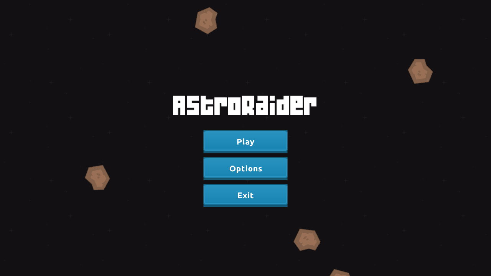
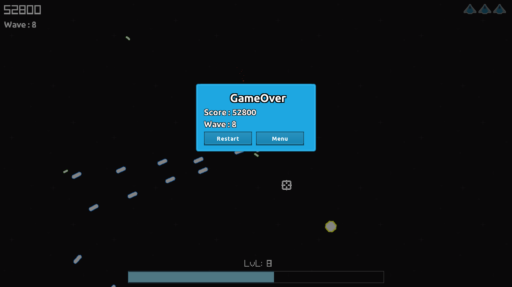
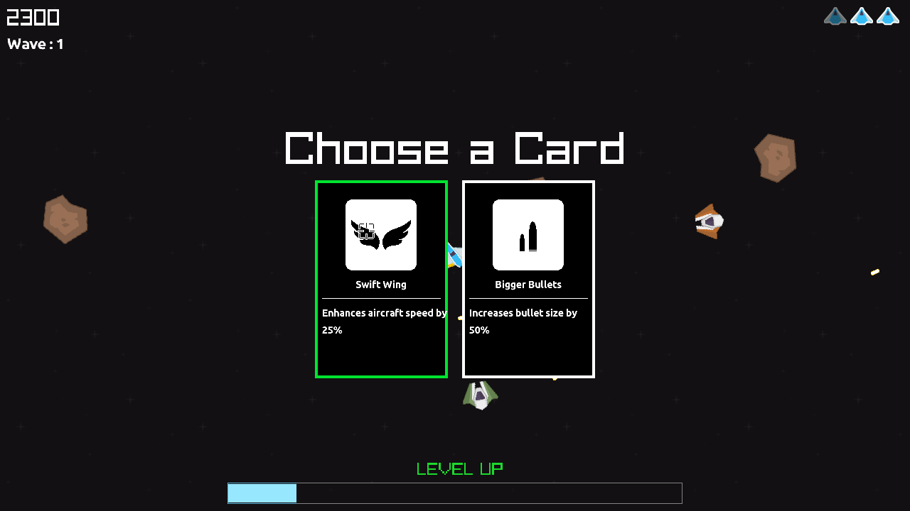

## Astro Raider

")

### Description

AstroRaider is a space-themed ship game where players can shoot and progress through waves every n seconds.

It features a leveling system where upon gaining a level, two random cards appear, allowing the player to choose their preferred upgrade.

### Features

 - LevelUp System
 - Waves of enemies
 - Diferentes types of enemies

### Controls

Keyboard:
 - W to move forward
 - Space to Shoot
 - Mouse Position to change direction of spaceship

### Screenshots

### Developers

 - $(Me) - $(Programmer)

### License

This game sources are licensed under an unmodified zlib/libpng license, which is an OSI-certified, BSD-like license that allows static linking with closed source software. Check [LICENSE](LICENSE) for further details.

